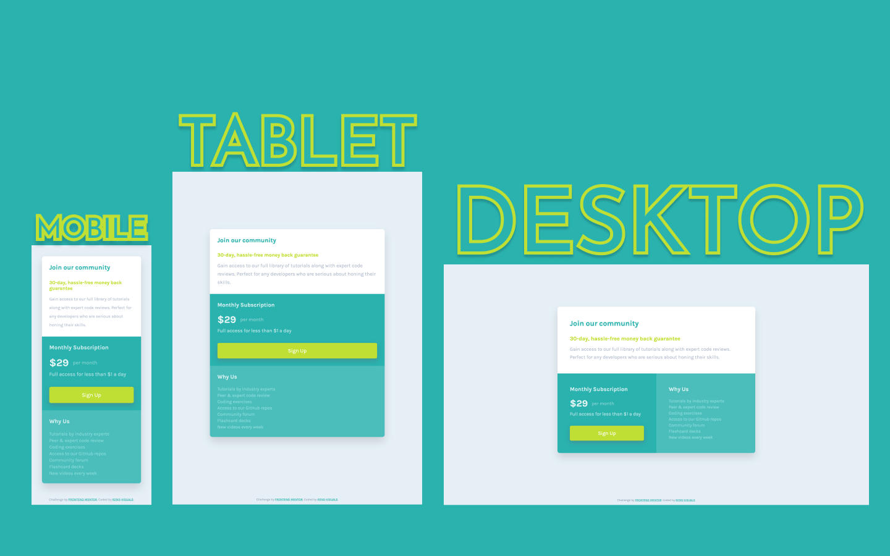

# Frontend Mentor - Single Price Grid Component Solution

This is a solution to the [Single Price Grid Component Challenge on Frontend Mentor](https://www.frontendmentor.io/challenges/single-price-grid-component-5ce41129d0ff452fec5abbbc).

## Table of contents

- [Overview](#overview)
  - [The challenge](#the-challenge)
  - [Screenshot](#screenshot)
  - [Links](#links)
- [My process](#my-process)
  - [Built with](#built-with)
  - [What I learned](#what-i-learned)
  - [Continued development](#continued-development)
  - [Useful resources](#useful-resources)
- [Author](#author)

## Overview

### The challenge

Users should be able to:

- View the optimal layout for the component depending on their device's screen size
- See a hover state on desktop for the Sign Up call-to-action

### Screenshot



### Links

- Live Site URL: [https://kens-visuals.github.io/single-price-grid-component/](https://kens-visuals.github.io/single-price-grid-component/)
- Solution URL: [TO_BE_UPDATED](https://your-solution-url.com)

## My process

### Built with

- Semantic HTML5 markup
- SCSS custom properties
- CSS Grid
- CSS Flexbox
- Mobile-first workflow

### What I learned

Initially when I started the project my only goal was to make it as close to the design as possible and finish the project in the same day. I achieved both of the goals and since I had a lot of time left until the end of the day, I decided to add some more challenges for me. So the challenge was to make the entire layout without media queries, yap you read that right, **WITH NO MEDIA QUERIES**. Perhaps the coolest part of `CSS Grid` is that, if you use them correctly, you can make your layout responsive. That small snippet of code, at the bottom of these text, takes care of the responsiveness of the entire project. However, it would've been impossible without `clamp()`. This was my first time using `clamp()`, so I had to do a bit of research to see where and how I can use it. I'll definitely use it in my future projects, perhaps not for `max-widht()`, but definitely for `font-size`. I might've abused the power of `clamp()`, but it all was for the sake of completing the project with no media queries whatsoever, just pushing the boundaries 👨🏻‍💻 This tiny project was one of the coolest project that I've done so far, and as you can tell I'm quite excited about it 😅

```css
.cube {
  display: grid;
  grid-template-columns: repeat(auto-fit, minmax(30rem, 1fr));
}
```

### Continued development

Definitely will work with `CSS Grid` and try to push its boundaries even further, and the same is also true for `clamp()`.

### Useful resources

- [Kevin Powell's video of `clamp()`](https://youtu.be/U9VF-4euyRo) - The vide that helped me the most to get the grasp of `clamp()`.
- [Kevin Powell's video of `auto-fit` and `auto-fill`](https://www.youtube.com/watch?v=qjJR3qYCd54) - I referenced one of my online lectures for this stuff, but Kevin, as always, does a great job of explaining `auto-fit` and `auto-fill`.
- [CSS Scan: `box-shadow`](https://getcssscan.com/css-box-shadow-examples) - Thanks to this awesome collection of `box-shadow`s that help me every time.
- [CSS for People Who Hate CSS](https://paulcpederson.com/articles/css-for-people-who-hate-css/) - **MUST READ**. Really cool website that simply explains how to work more efficiently with CSS.

## Author

- Frontend Mentor - [@kens-visuals](https://www.frontendmentor.io/profile/kens-visuals)
- Codewars - [@kens_visuals](https://www.codewars.com/users/kens_visuals)
- CodePen - [@kens-visuals](https://codepen.io/kens-visuals)
